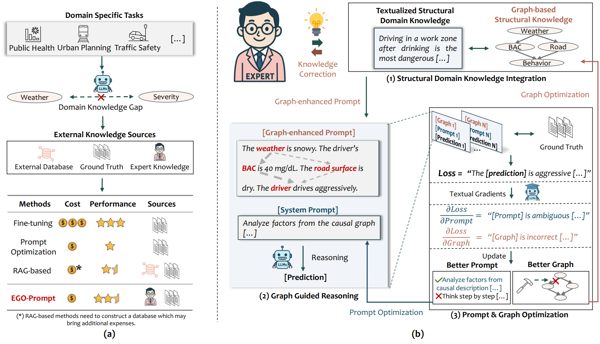

# EGO-Prompt: How to Auto-optimize Prompts for Domain Tasks? Adaptive Prompting and Reasoning through Evolutionary Domain Knowledge Adaptation

## Overview
EGO-Prompt can be used to find better prompts for domain-specific tasks.



## Setup

```
conda create -n ego_prompt python=3.11
source activate ego_prompt
pip install python-dotenv tqdm textgrad numpy scikit-learn matplotlib pandas
```

## 🔄 Update Checklist

- [x] Update Evaluation Code
- [ ] Update instructions on how to use your own datasets  
- [ ] Merge GPT-5 calling code

# Results summary

This is the summary of the results shown in our demos (3 runs). 

| Method | Swissmetro | TrafficSafe | Pandemic |
|:----------------------------|:-----------:|:-------------:|:-----------:|
| Organized Prompt (Mean ± Std) | 0.4075 ± 0.0168 | 0.2269 ± 0.0364 | 0.3477 ± 0.0183 |
| **Ego-Prompt (Mean ± Std)** | **0.4915 ± 0.0330** | **0.3156 ± 0.0123** | **0.3656 ± 0.0447** |
| Organized Prompt (Best) | 0.4238 | 0.2682 | 0.3662 |
| **Ego-Prompt (Best)** | **0.5262** | **0.3291** | **0.3948** |


## Citation


```
@inproceedings{zhao2025how,
  author = {Yang Zhao, Pu Wang, Hao Frank Yang},
  title = {How to Auto-optimize Prompts for Domain Tasks? Adaptive Prompting and Reasoning through Evolutionary Domain Knowledge Adaptation},
  booktitle={The Thirty-Ninth Annual Conference on Neural Information Processing Systems (NeurIPS)},
  year = {2025},
}
```

Contact yzhao229@jh.edu or open an issue if you have any questions.

## Acknowledgments

The code is based on the following repositories:
- [TextGrad](https://github.com/zou-group/textgrad)
