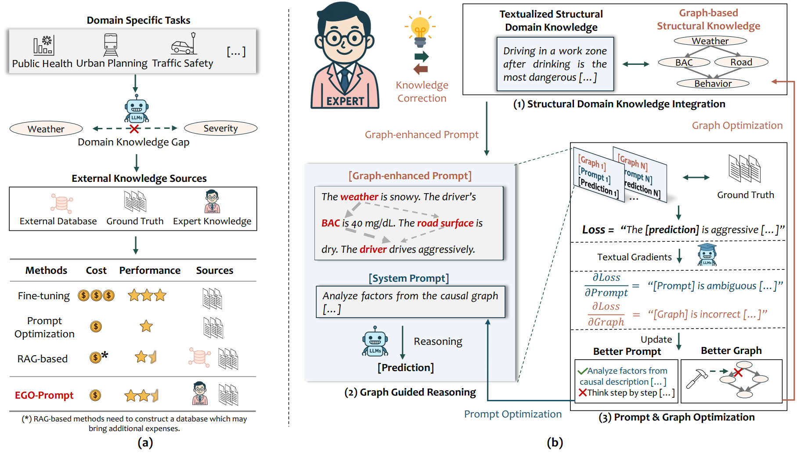

# EGO-Prompt: How to Auto-optimize Prompts for Domain Tasks? Adaptive Prompting and Reasoning through Evolutionary Domain Knowledge Adaptation

## Overview
EGO-Prompt can be used to find better prompts for domain-specific tasks.

[Read Paper Here](https://arxiv.org/abs/2510.21148)



## Updates (v2)

1. **No TextGrad dependency.** The backward pass is written as explicit prompts: errors are diagnosed and attributed
   to the causal graph or the prediction prompt, several candidate edits are proposed per prompt, and causal-graph
   edits (add / modify / delete) are checked by the forward model before scoring.
2. **Latest models.** GPT-5.x / GPT-6 and Claude on Amazon Bedrock, or any provider through LiteLLM (OpenAI,
   Anthropic, Gemini, ...), with thinking off by default. Concurrent, cached evaluation makes a run take minutes.
3. **Population search with crossover.** Three prompt lineages evolve in parallel with simulated-annealing
   acceptance, and the weakest one is periodically crossed over with the best, which improves results and stability.

## Setup

```
conda create -n ego_prompt python=3.11
source activate ego_prompt
pip install -r requirements.txt
```

## Usage

```
python run.py --task swiss --baselines --fwd <forward model> --bwd <backward model>
```

`--task` is `swiss`, `trafficsafe` or `pandemic`. Models:

| Prefix | Example | Credentials |
|:---|:---|:---|
| `mantle:` (Bedrock, OpenAI-compatible) | `mantle:openai.gpt-5.6-luna` | `AWS_BEARER_TOKEN_BEDROCK` or AWS keys |
| `claude:` (Claude on Bedrock) | `claude:anthropic.claude-sonnet-5` | same |
| `openai:` | `openai:gpt-5-mini` | `OPENAI_API_KEY` |
| `litellm:` (any LiteLLM provider) | `litellm:anthropic/claude-sonnet-5`, `litellm:gemini/gemini-2.5-flash`, `litellm:bedrock/us.anthropic.claude-sonnet-4-6` | the provider's key |

Results are written to `res/<run>/result.json` (test F1 of the optimized prompts, the initial prompts and, with
`--baselines`, the organized prompt; token usage and cost).

# Results summary

Test weighted F1, 3 runs, forward GPT-5.6 Luna, backward Claude Sonnet 5.

| Method | Swissmetro | TrafficSafe | Pandemic |
|:----------------------------|:-----------:|:-------------:|:-----------:|
| Organized Prompt (Mean ± Std) | 0.3900 ± 0.0200 | 0.2142 ± 0.0200 | 0.3921 ± 0.0101 |
| **Ego-Prompt v2 (Mean ± Std)** | **0.5246 ± 0.0369** | **0.4268 ± 0.0506** | **0.4595 ± 0.0307** |
| Organized Prompt (Best) | 0.4115 | 0.2363 | 0.4005 |
| **Ego-Prompt v2 (Best)** | **0.5578** | **0.4786** | **0.4922** |
| Gain over organized prompt, v2 | +34.5% | +99.3% | +17.2% |
| Gain over organized prompt, v1 (GPT-4o-mini / GPT-4o) | +20.6% | +39.1% | +5.1% |

Budget per run (same models; v1 estimated from its call counts):

| | Swissmetro | TrafficSafe | Pandemic |
|:----------------------------|:-----------:|:-------------:|:-----------:|
| v1 cost | $8.4 | $11.8 | $8.7 |
| **v2 cost** | **$3.1** | **$4.4** | **$5.5** |
| v1 LLM calls | 9.0k | 16.8k | 10.6k |
| **v2 LLM calls** | **6.2k** | **9.1k** | **9.0k** |

## Citation


```
@inproceedings{zhao2025how,
  author = {Yang Zhao, Pu Wang, Hao Frank Yang},
  title = {How to Auto-optimize Prompts for Domain Tasks? Adaptive Prompting and Reasoning through Evolutionary Domain Knowledge Adaptation},
  booktitle={The Thirty-Ninth Annual Conference on Neural Information Processing Systems (NeurIPS)},
  year = {2025},
}
```

Contact yzhao229@jh.edu or open an issue if you have any questions.

## Acknowledgments

v1 was built on [TextGrad](https://github.com/zou-group/textgrad).
